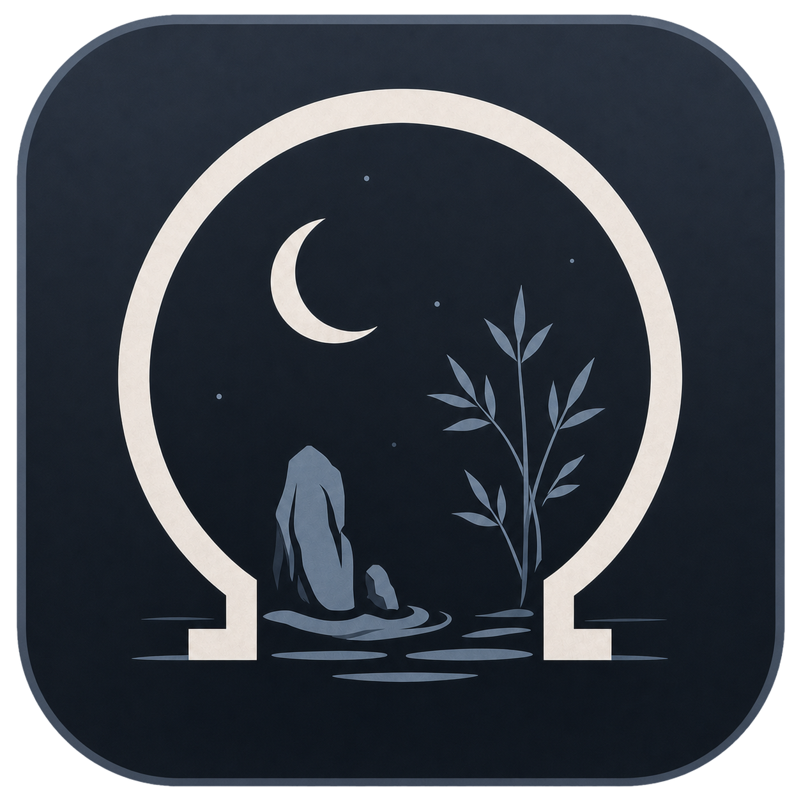

<p align="center">
  
</p>

<h1 align="center">Yoiniwa · 宵庭</h1>

<p align="center">
  面向绘画工作流的 Windows 本地参考图画板<br />
  A local-first Windows reference board for artists.
</p>

<p align="center">
  <a href="https://github.com/lengjinyang/Yoiniwa/actions/workflows/ci.yml"></a>
  
  
  
</p>

Yoiniwa（宵庭）使用 Electron、React、TypeScript 与 PixiJS 构建。它提供无限画布、图片整理、非破坏性编辑、嵌入式工程文件及 Photoshop 取色协作，核心工作流无需云服务。

> [!IMPORTANT]
> Photoshop 协作模式的最高优先级不变量是：从 Yoiniwa 取色后，回到 Photoshop 的第一次真实笔尖按下必须能够正常绘画。自动测试和鼠标模拟不能替代真实 Windows Ink 数位板验证；涉及窗口、焦点或原生输入的改动在发布前必须实机复测。

## 下载

- [Yoiniwa 0.1.0 预发行版](https://github.com/lengjinyang/Yoiniwa/releases/tag/v0.1.0)
- Windows x64 安装包：`Yoiniwa-0.1.0-Setup.exe`

当前安装包尚未使用商业代码签名证书，Windows 可能显示“未知发布者”。请只从本仓库 Releases 页面下载，并按 Release 中提供的 SHA-256 校验文件。

## 主要功能

### 画布与图片整理

- 无限画布、光标中心缩放、平移、聚焦选中内容和适合画板
- 文件选择、拖放、剪贴板及 HTTP(S) 图片导入
- 单选、框选、多选、移动、缩放、旋转、翻转、透明度和锁定
- 非破坏性裁剪、灰度与对比度调整、气泡评论和标注工具
- 边缘/中心吸附、紧密排列、对齐、分布、尺寸统一及嵌套分组
- 200 步撤销/重做，PNG/JPEG 导出及合成图复制

### 工程与性能

- 图片嵌入式 `.yoi` 工程、最近打开、自动保存和未保存提醒
- 兼容旧 `.refcanvas` 工程，重新保存时迁移为 `.yoi`
- Windows 资源管理器 `.yoi` 缩略图提供程序
- PixiJS v8 GPU 渲染、分级纹理、超大图片金字塔和分块缓存
- 缓存目录迁移、容量管理与损坏缓存回退

### Photoshop 与窗口协作

- 从参考图原始像素取色并同步 Photoshop 前景色；失败时复制 HEX
- 协作模式、始终置顶、窗口透明度、锁定窗口和鼠标穿透
- Photoshop 文档预览、版本记录以及选中内容发送到 Photoshop
- 全局安全快捷键退出鼠标穿透

## 使用要求

运行安装版：

- Windows 10/11 x64
- Photoshop 为可选项，仅协作功能需要

从源码开发：

- Node.js 22 或更高版本
- npm
- Windows 下执行完整生产构建时，需要 Visual Studio 2022 C++ Build Tools（用于资源管理器缩略图 DLL）

## 本地开发

```powershell
git clone https://github.com/lengjinyang/Yoiniwa.git
cd Yoiniwa
npm ci
npm run dev
```

常用命令：

| 命令 | 说明 |
| --- | --- |
| `npm run check` | 类型检查、ESLint、死代码检查和单元测试 |
| `npm run build` | 构建 Electron 主进程、缩略图组件和渲染器 |
| `npm run dist` | 生成 Windows NSIS 安装包到 `release/` |
| `npm run smoke` | 运行基础应用验收测试 |
| `npm run smoke:photoshop` | 使用假的 Photoshop 桥接运行自动化往返测试 |

## 常用操作

| 操作 | 快捷键或手势 |
| --- | --- |
| 导入图片 | `Ctrl+I` |
| 保存 / 另存为 | `Ctrl+S` / `Ctrl+Shift+S` |
| 新建 / 打开工程 | `Ctrl+K` / `Ctrl+L` |
| 撤销 / 重做 | `Ctrl+Z` / `Ctrl+Shift+Z` |
| 聚焦选中 / 显示整个画板 | `Space` / `Ctrl+Space` |
| 标注模式 | `Q`；`1` 画笔、`2` 箭头、`3` 矩形、`4` 椭圆、`E` 橡皮擦 |
| 默认取色 | `S + 左键`，可在交互设置中改为 `Alt + 左键` |
| 创建 / 清空分组 | `Ctrl+G` / `Ctrl+Shift+G` |
| 紧密排列 | `Ctrl+P` |
| 显示 / 隐藏属性面板 | `Tab` |
| 平移画布 | 鼠标中键拖动；取色键不是 `Alt` 时也可 `Alt + 左键` |
| 旋转 / 缩放 / 透明度 | `Ctrl` / `Ctrl+Alt` / `Ctrl+Alt+Shift` + 左键拖动 |
| 退出鼠标穿透 | `Ctrl+Alt+Shift+T` |

右键点击打开功能菜单；右键拖动移动窗口。完整行为以应用内菜单和属性面板为准。

## 数据与隐私

- 工程和图片资产默认保存在本地，不要求账号或云服务。
- 应用不包含遥测上报；只有用户主动导入 HTTP(S) 图片时才会访问对应地址。
- `.yoi` 包含嵌入的图片或 Photoshop 版本数据，分享前请确认其中没有敏感素材。

## 项目文档

- [架构说明](docs/ARCHITECTURE.md)
- [调试指南](docs/DEBUGGING.md)
- [性能审计](docs/performance/PERFORMANCE_AUDIT.md)
- [`.yoi` v4 存储格式](docs/YOI_STORAGE_V4.md)
- [贡献指南](CONTRIBUTING.md)
- [安全政策](SECURITY.md)

## 参与贡献

提交 Issue 或 Pull Request 前请阅读 [CONTRIBUTING.md](CONTRIBUTING.md)。涉及协作模式、窗口焦点、Windows Ink、原生输入或 Photoshop 桥接的修改必须遵守其中的数位板验证要求。

## 许可证

本项目目前未发布开源许可证。源代码公开仅供查看、学习和交流；复制、修改、分发或商业使用前，请先获得仓库所有者许可。

## 项目关系说明

Yoiniwa 不隶属于 PureRef，也不使用 PureRef 的名称、素材、快捷键全集或 `.pur` 文件格式。Adobe 与 Photoshop 是 Adobe 在美国和/或其他国家/地区的商标；本项目与 Adobe 无隶属或背书关系。
